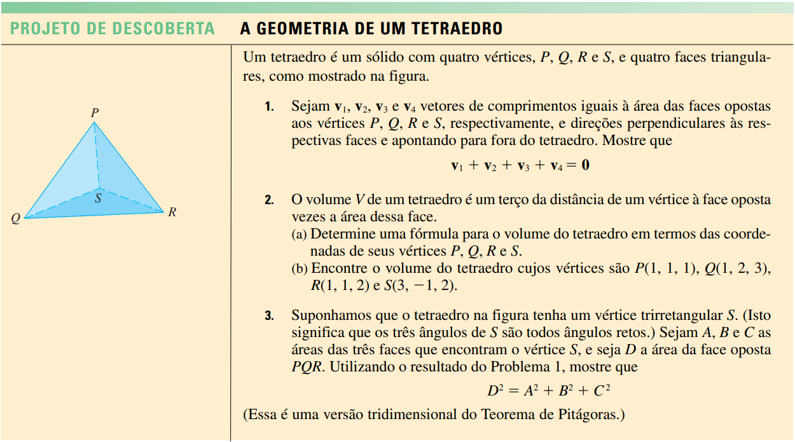

## O que é um tetraedro?

O tetraedro é um dos sólidos geométricos mais fundamentais da matemática e da geometria espacial. Ele pertence ao grupo dos cinco sólidos platônicos, caracterizados por faces congruentes, ângulos internos idênticos e vértices uniformemente distribuídos. Composto por quatro faces triangulares, seis arestas e quatro vértices, o tetraedro é a forma tridimensional mais simples que pode existir.

Neste post, vamos usar o R para explorar a geometria de um tetraedro. Usaremos o pacote `rgl` para visualizar o tetraedro.


::: {.callout-tip}
## Sobre o post
Este poste é a resolução de um exercício do livro "Cáculo Volume 2"  do James Stewart com aplicações em R. O exercicio pode ser encontrado na página 734 do livro. Abaixo segue o enunciado do exercicio:




:::

## Carregando Pacotes

Carregando o pacote rgl para visualização interativa de gráficos 3D. O pacote rgl é necessário para visualizar gráficos 3D interativos no R Markdown.

```{r message=TRUE, warning=TRUE}
library(rgl)
```

## 1. Execício 1

Um tetraedro é um sólido com quatro vértices, P, Q, R e S, e quatro faces triangulares Sejam $\vec{v_1}$, $\vec{v_2}$, $\vec{v_3}$ e $\vec{v_4}$ vetores de comprimentos iguais à área das faces opostas aos vértices P,Q, R e S, respectivamente, e direções perpendiculares às respectivas faces e apontando parafora do tetraedro. Mostre que:
$${\vec{v_1} + \vec{v_2} + \vec{v_3} + \vec{v_4} = 0}$$

Seja o tetraedo qualquer, com vertices em $P(p_1, p_2, p_3)$, $Q(q_1, q_2, q_3)$, $R(r_1, r_2, r_3)$ e $S(s_1, s_2, s_3)$. Podemos construir essa figura da seguinte forma:

```{r}
# Coordenadas dos vértices do tetraedro unitário
vertices <- matrix(c(
  0, 0,
  1, 0,
  0.5, sqrt(3)/2,
  0.5, sqrt(3)/6
), ncol = 2, byrow = TRUE)

# Projeção ortográfica dos vértices em 2D
proj_x <- vertices[, 1]
proj_y <- vertices[, 2]

# Nome dos pontos
nomes_pontos <- c("Q","S","R","P")

# Plotar os vértices com nome
plot(proj_x, proj_y, type = "n", xlab = "", ylab = "", main = "Tetraedro 2D")
text(proj_x, proj_y, nomes_pontos, pos = 4)

# Conectar os vértices para formar o tetraedro
segments(proj_x[1], proj_y[1], proj_x[2], proj_y[2], col = "Black")
segments(proj_x[2], proj_y[2], proj_x[3], proj_y[3], col = "Black")
segments(proj_x[3], proj_y[3], proj_x[1], proj_y[1], col = "Black")
segments(proj_x[1], proj_y[1], proj_x[4], proj_y[4], col = "Black")
segments(proj_x[2], proj_y[2], proj_x[4], proj_y[4], col = "Black")
segments(proj_x[3], proj_y[3], proj_x[4], proj_y[4], col = "Black")

```

$$\vec{PQ}= Q - P = (q_1 - p_1, q_2 - p_2, q_3 - p_3)$$ $$\vec{QR}= R - Q = (r_1 - q_1, r_2 - q_2, r_3 - q_3)$$ $$\vec{RP}= P - R = (p_1 - r_1, p_2 - r_2, p_3 - r_3)$$ $$\vec{RS}= S - R = (s_1 - r_1, s_2 - r_2, s_3 - r_3)$$ $$\vec{SP}= P - S = (p_1 - s_1, p_2 - s_2, p_3 - s_3)$$ $$\vec{SQ}= Q - S = (q_1 - s_1, q_2 - s_2, q_3 - s_3)$$ $$\vec{QR}= R - Q = (r_1 - q_1, r_2 - q_2, r_3 - q_3)$$ $$\vec{QS}= S - Q = (s_1 - q_1, s_2 - q_2, s_3 - q_3)$$ Assim, o vetor area de cada lado do tetraedro é dado pelo podruto interno de dois vetores que estão contidos no plano da face do tetraedro dividido por 2. Assim, temos que o vetor area de cada face do tetraedro é dado por:

$$\vec{v_1} = \frac{1}{2} \left( \vec{QP} \times \vec{QR} \right) $$ $$\vec{v_2} = \frac{1}{2} \left( \vec{RP} \times \vec{RS} \right) $$ $$ \vec{v_3} = \frac{1}{2} \left( \vec{SP} \times \vec{SQ} \right) $$ $$ \vec{v_4} = \frac{1}{2} \left( \vec{RQ} \times \vec{SQ} \right) $$ Assim, temos que, para o primeiro vetor: $$
\vec{v_1}=\frac{1}{2} \begin{bmatrix}
i & j & k \\
p_1 - q_1 & p_2 - q_2 & p_3 - q_3 \\
r_1 - q_1 & r_2 - q_2 & r_3 - q_3 \\
\end{bmatrix}
$$ Para o segundo vetor, temos a seguinte matriz: $$
\vec{v_2}=\frac{1}{2} \begin{bmatrix}
i & j & k \\
p_1 - r_1 & p_2 - r_2 & p_3 - r_3 \\
s_1 - r_1 & s_2 - r_2 & s_3 - r_3 \\
\end{bmatrix}
$$ Para o terceiro vetor, temos a seguinte matriz: $$
\vec{v_3}=\frac{1}{2} \begin{bmatrix}
i & j & k \\
p_1 - s_1 & p_2 - s_2 & p_3 - s_3 \\
q_1 - s_1 & q_2 - s_2 & q_3 - s_3 \\
\end{bmatrix}
$$ Para o quarto vetor, temos a seguinte matriz: $$
\vec{v_4}=\frac{1}{2} \begin{bmatrix}
i & j & k \\
r_1 - q_1 & r_2 - q_2 & r_3 - q_3 \\
s_1 - q_1 & s_2 - q_2 & s_3 - q_3 \\
\end{bmatrix}
$$ Assim, temos que o vetor $\vec{v_1}$ é dado por: $$
\vec{v_1}=\frac{1}{2}(\hat{i} (p_2 r_3 - p_2 q_3 - q_2 r_3 - p_3 r_2 + p_3 q_2 + q_3 r_2) + \hat{j} (p_3 q_1 - p_3 r_1 + p_1 r_3 - p_1 q_3 - q_3 r_1 + q_1 r_3) + \hat{k} (p_2 q_1 - p_2 r_1 + p_1 r_2 - p_1 q_2 - q_2 r_1 + q_1 r_2))
$$ Assim, temos que o vetor $\vec{v_2}$ é dado por: $$
\vec{v_2=}\frac{1}{2}(\hat{i} (p_3 (r_2 - s_2) + p_2 (s_3 - r_3) + r_3 s_2 - r_2 s_3) + \hat{j} (p_3 (s_1 - r_1) + p_1 (r_3 - s_3) - r_3 s_1 + r_1 s_3) + \hat{k} (p_2 (r_1 - s_1) + p_1 (s_2 - r_2) + r_2 s_1 - r_1 s_2))
$$ Assim, temos que o vetor $\vec{v_3}$ é dado por: $$
\vec{v_3}=\frac{1}{2}(\hat{i}(p_3 (s_2 - q_2) + p_2 (q_3 - s_3) - q_3 s_2 + q_2 s_3) + \hat{j}(p_3 (q_1 - s_1) + p_1 (s_3 - q_3) + q_3 s_1 - q_1 s_3) + \hat{k}(p_2 (s_1 - q_1) + p_1 (q_2 - s_2) - q_2 s_1 + q_1 s_2))
$$ Assim, temos que o vetor $\vec{v_4}$ é dado por: $$
\vec{v_4}=\frac{1}{2}(\hat{i}(q_3 (s_2 - r_2) + q_2 (r_3 - s_3) - r_3 s_2 + r_2 s_3) + \hat{j} (q_3 (r_1 - s_1) + q_1 (s_3 - r_3) + r_3 s_1 - r_1 s_3) + \hat{k} (q_2 (s_1 - r_1) + q_1 (r_2 - s_2) - r_2 s_1 + r_1 s_2))
$$ Comparando a primeira coordenada $\hat{i}$ de cada vetor, temos que: $$
\begin{cases}
    \vec{v_{1x}} = \frac{1}{2}(\hat{i} (p_2r_3 - p_2q_3 - q_2r_3 - p_3r_2 + p_3q_2 + q_3r_2)) \\
    \vec{v_{2x}} = \frac{1}{2}(\hat{i} (p_3r_2 - p_3s_2 + p_2s_3 - p_2r_3 + r_3s_2 - r_2s_3)) \\
    \vec{v_{3x}} = \frac{1}{2}(\hat{i} (p_3s_2 - p_3q_2 + p_2q_3 - p_2s_3 - q_3s_2 + q_2s_3)) \\
    \vec{v_{4x}} = \frac{1}{2}(\hat{i} (q_3s_2 - q_3r_2 + q_2r_3 - q_2s_3 - r_3s_2 + r_2s_3)) \\
\end{cases}
$$ Deste modo, somando as coordenadas $\hat{i}$ de cada vetor, temos que: $$
\vec{v_{1x}} + \vec{v_{2x}} + \vec{v_{3x}} + \vec{v_{4x}} = 0
$$ Assim, temos que a soma das coordenadas $\hat{i}$ de cada vetor é igual a zero. Analogamente, temos que a soma das coordenadas $\hat{j}$ e $\hat{k}$ de cada vetor também é igual a zero. Deste modo, temos que a soma de todos os vetores é igual a zero.

## 2. Exercício 2

O volume V de um tetraedro é um terço da distância de um vértice à face oposta vezes a área dessa face.

### a)

Determine uma fórmula para o volume do tetraedro em termos das coordenadas de seus vértices P, Q, R e S.

Deste modo temos que o Volume $V$ de um tetraedro é dado por: $$
V = \frac{1}{3}Bh
$$ onde $h$ é a distancia do vértice ao plano formado pela face oposta, ou seja, a autura do tetraedro e $B$ é a área da face oposta. Em outra palavras, o volumo do tetaedro é igual a um terço da area da base vezes a altura. Para um tetraedro qualquer, com vértices em $P(p_1, p_2, p_3)$, $Q(q_1, q_2, q_3)$, $R(r_1, r_2, r_3)$ e $S(s_1, s_2, s_3)$, temos que a distância de um vértice qualquer $P$ à face oposta é dada por: $$
d = \frac{|\vec{n} \cdot \vec{P}|}{|\vec{n}|}
$$ e que a area de um lado do tetraedro é dada pelo modulo do vetor normal a face oposta $$
A = |\vec{n}|
$$ Assim, temos que o volume do tetraedro é dado por: $$
V = \frac{1}{3} \frac{|\vec{n} \cdot \vec{P}|}{|\vec{n}|} |\vec{n}|
$$ simplificando: $$
V = \frac{1}{3} |\vec{n} \cdot \vec{P}|
$$ Seja $\vec{n}$ o produto interno entre os vetores $\vec{SQ}$ e $\vec{SR}$, temos que: $$
\vec{n} = \vec{SQ} \times \vec{SR}
$$ Resolvendo, e isolando $i$, $j$ e $k$, temos que: $$
 \vec{SQ} \times \vec{SR}=\begin{bmatrix}
i & j & k \\
q_1 - s_1 & q_2 - s_2 & q_3 - s_3 \\
r_1 - s_1 & r_2 - s_2 & r_3 - s_3 \\
\end{bmatrix}
$$ $$
\hat{i} (q_2- s_2)(r_3 - s_3) - (q_3 - s_3)(r_2 - s_2) + \hat{j} (q_3 - s_3)(r_1 - s_1) - (q_1 - s_1)(r_3 - s_3) + \hat{k} (q_1 - s_1)(r_2 - s_2) - (q_2 - s_2)(r_1 - s_1)
$$

################################################### 

################################################## 

### b)

Encontre o volume do tetraedro cujos vértices são $P(1 , 1, 1)$, $Q(1, 2, 3)$, $R(1 , 1, 2)$ e $S(3, -1, 2)$.

Definino as coordenadas dos vértices do tetraedro.

```{r}
# Coordenadas dos vértices do tetraedro
vertices <- matrix(c(
1, 1, 1,
1, 2, 3,
1, 1, 2,
3, -1, 2
), ncol = 3, byrow = TRUE)
```

Definindo a matriz das faces do tetraedro regular.

```{r}
# Conectividade das faces do tetraedro
faces <- matrix(c(
  1, 2, 3,
  1, 2, 4,
  2, 3, 4,
  1, 3, 4
), ncol = 3, byrow = TRUE)

```

Plotando o tetraedro regular, acordo com a sua orientação.

```{r}
# Plotar os vértices
plot3d(vertices, type = "s", col = "red", size = )
#conectandos os seguimentos rglwidget
# Conectar os vértices do tetraedro
segments3d(vertices[c(1, 2), ], col = "black")
segments3d(vertices[c(1, 3), ], col = "black")
segments3d(vertices[c(1, 4), ], col = "black")
segments3d(vertices[c(2, 3), ], col = "black")
segments3d(vertices[c(2, 4), ], col = "black")
segments3d(vertices[c(3, 4), ], col = "black")
rglwidget()

```

```{r}
#plotando o solido em 2 dimensões
# Coordenadas dos vértices do tetraedro regular
vertices <- matrix(c(
  1, 1, 1,
  1, 2, 3,
  1, 1, 2,
  3, -1, 2
), ncol = 3, byrow = TRUE)

# Projeção ortográfica dos vértices em 2D
proj_x <- vertices[, 1]
proj_y <- vertices[, 2]

# Plotar os vértices projetados
plot(proj_x, proj_y, type = "n", xlim = c(min(proj_x), max(proj_x)), ylim = c(min(proj_y), max(proj_y)))
segments(proj_x[1], proj_y[1], proj_x[2], proj_y[2])
segments(proj_x[2], proj_y[2], proj_x[3], proj_y[3])
segments(proj_x[3], proj_y[3], proj_x[1], proj_y[1])
segments(proj_x[1], proj_y[1], proj_x[4], proj_y[4])
segments(proj_x[2], proj_y[2], proj_x[4], proj_y[4])
segments(proj_x[3], proj_y[3], proj_x[4], proj_y[4])

```

Calculando o vetor normal a cada face do tetraedro.

```{r}
# Calcular os vetores normais a cada face do tetraedro
normais <- matrix(0, nrow = nrow(faces), ncol = 3)
for (i in 1:nrow(faces)) {
  # Calcular o vetor normal a cada face
  v1 <- vertices[faces[i, 1], ] - vertices[faces[i, 2], ]
  v2 <- vertices[faces[i, 1], ] - vertices[faces[i, 3], ]
  # Usar o produto vetorial entre v1 e v2 para obter o vetor normal
  normais[i, ] <- crossprod(v1, v2)
}

# Mostrar os vetores normais
print(normais)

```

calculando o volume do tetraedro

```{r}
# Calcular o volume do tetraedro
volume <- sum(apply(normais, 1, function(x) sum(x * vertices[faces[1, 1], ])))/6
volume
```