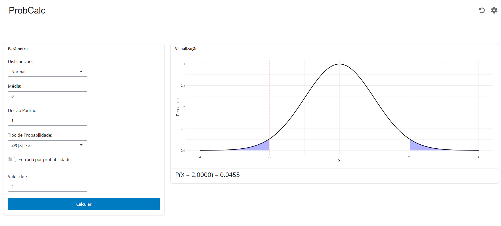
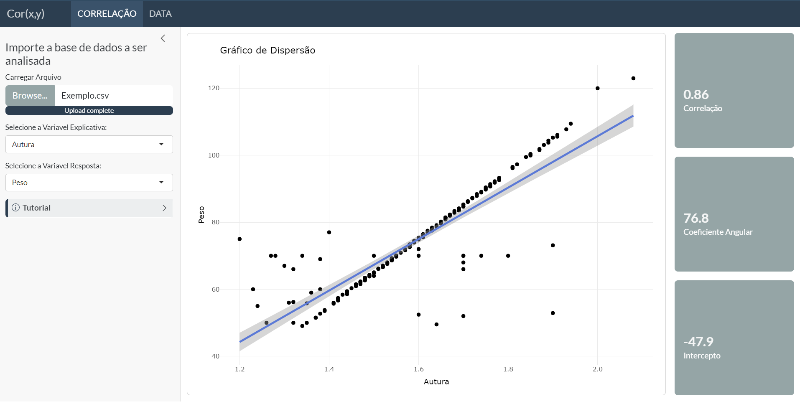
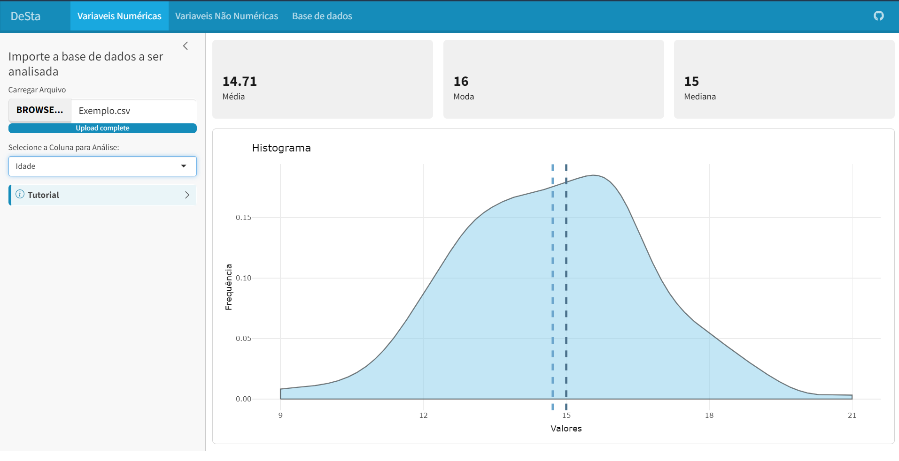
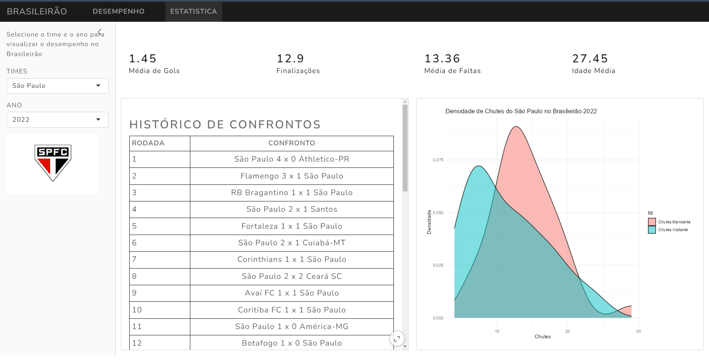

  <h1 class="hero-title">Aplicativos Shiny</h1>
  
Ferramentas interativas desenvolvidas em R para explorar conceitos de estatística, modelos de regressão e análise exploratória de dados.

::: {.grid}

::: {.g-col-12 .g-col-md-6}

### Calculadora de Probabilidades (ProbCalc)
R Shiny Estatística Multilíngue

Um aplicativo completo para calcular e visualizar distribuições de probabilidade discretas e contínuas. Permite calcular probabilidades acumuladas, quantis e gerar gráficos de densidade com suporte a português, inglês e espanhol.

{.preview-image}

  <a href="https://github.com/bonijoao/probcalc" class="btn btn-primary" target="_blank">Acessar Repositório / App →</a>

:::

::: {.g-col-12 .g-col-md-6}

### Correlação e Regressão Linear (cor_xy)
R Shiny Regressão ggplot2

Ferramenta interativa para medir a correlação linear entre duas variáveis contínuas e ajustar um modelo de regressão linear simples, exibindo o intercepto, coeficiente angular e diagnóstico dos resíduos.

{.preview-image}

  <a href="https://joaobonifacio.shinyapps.io/cor_xy/" class="btn btn-primary" target="_blank">Acessar Aplicativo →</a>

:::

::: {.g-col-12 .g-col-md-6}

### Estatística Descritiva (DeSta)
R Shiny Análise Descritiva Tidyverse

Aplicação para análise exploratória descritiva que permite importação de conjuntos de dados, cálculo automático de medidas de posição e dispersão, e geração de gráficos de dispersão e barras.

{.preview-image}

  <a href="https://joaobonifacio.shinyapps.io/aplicativo_v2/" class="btn btn-primary" target="_blank">Acessar Aplicativo →</a>

:::

::: {.g-col-12 .g-col-md-6}

### Brasileirão Série A
R Shiny Futebol Dados Esportivos

Aplicação para análise comparativa de desempenho de todos os clubes da Série A do Campeonato Brasileiro de Futebol na era dos pontos corridos.

{.preview-image}

  <a href="https://joaobonifacio.shinyapps.io/brasileirao/" class="btn btn-primary" target="_blank">Acessar Aplicativo →</a>

:::

:::